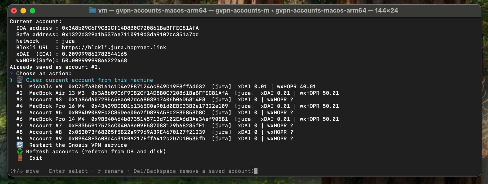

# Gnosis VPN Account Manager



A standalone Node.js CLI for managing multiple Gnosis VPN **accounts** (HOPR identities) on a single
machine and swapping the active one on demand. Encrypted account files are stored in MySQL so they
can be restored later.

This tool does not touch the Gnosis VPN client's binaries or packaging. It interacts with the
*installed* client through these external interfaces only:

1. **On-disk account files** under `$GNOSISVPN_HOME/.config/`:
   - `gnosisvpn-hopr.id` — encrypted HOPR identity
   - `gnosisvpn-hopr.pass` — identity password
   - `gnosisvpn-hopr.safe` — YAML with `safe_address` + `module_address`
2. **The `gnosis_vpn-ctl` CLI** — `gnosis_vpn-ctl --output json balance` for the node EOA + safe.
3. **The service manager** — systemd (Linux) / launchd (macOS) to stop/start the client.
4. **Client-generated state**, when you reset a machine: the rest of `$GNOSISVPN_HOME`
   (the node database, caches) plus the runtime socket/lock files and the client log.
5. **The client's network configuration**, and only when you switch networks: the
   `/etc/gnosisvpn/config.toml` symlink, `/etc/gnosisvpn/gnosisvpn-dynamic.env` (Linux), and the
   launchd plist + `network_choice` (macOS). These are written exactly as the client's own
   installer writes them — see [Switching networks](#switching-networks).

`$GNOSISVPN_HOME` defaults: Linux `/var/lib/gnosisvpn`, macOS `/Library/Application Support/GnosisVPN`.

## Install

```sh
npm install
```

## Configure

Copy `.env.example` to `.env` and fill in your MySQL credentials and an encryption key:

```sh
cp .env.example .env
# edit .env
```

Or point at an existing `.env` with `--env <path>`.

## Build standalone binaries

The CLI can be packaged into a single self-contained executable (no Node.js
required on the target machine). The build bundles the source + dependencies
with esbuild, then packages them with [`@yao-pkg/pkg`](https://github.com/yao-pkg/pkg).

```sh
npm install          # installs build tooling (esbuild, pkg)

npm run build        # all targets: linux x64/arm64, macOS arm64
scripts/build.sh host                       # just the current platform
scripts/build.sh node22-linux-x64           # one or more explicit targets
```

Output binaries land in `dist/bin/`, e.g. `gvpn-accounts-linux-x64`,
`gvpn-accounts-macos-arm64`.

```sh
sudo ./gvpn-accounts-linux-x64 swap 3
```

### Baked-in config

At build time the `.env` is **baked into each binary**: the MySQL credentials
are encrypted with `ENCRYPTION_KEY`, and the key itself is XOR-obfuscated. A
built binary is therefore self-contained — it reads its embedded config and
**ignores any `.env`** at runtime. Build against a different `.env` with:

```sh
GVPN_ENV_FILE=/path/to/.env npm run build
```

> ⚠️ **This is obfuscation, not security.** Because the binary must decrypt its
> own config, both the encrypted creds and the (obfuscated) `ENCRYPTION_KEY`
> ship inside it. Anyone with the binary and some effort can recover the key —
> and therefore the DB credentials and every saved account identity. It only
> prevents trivial `strings`-grepping. Treat the binaries as secrets and
> distribute them accordingly.

When running from source (`node src/index.js`) there is no embedded config, so
the `.env` in the working directory (or `--env <path>`) is used as normal.

## Usage

```sh
# Interactive menu: shows the current account, offers to save it, and lets you
# swap/rename/delete saved accounts, clear the machine, or restart the service
node src/index.js

# Print the active on-disk account
node src/index.js current

# List saved accounts
node src/index.js list

# Save the current on-disk account to the DB
node src/index.js save --name "my-account" --network jura-prod

# Swap to a saved account by id
node src/index.js swap 3

# Reset this machine to a freshly-installed client state
node src/index.js clear

# ...and point the client at another network at the same time
node src/index.js clear --switch-network jura-dev

# Switch networks, keeping the account on disk
node src/index.js switch-network piz-palu-dev
```

Global options:

- `--env <path>` — path to the `.env` file (default: `.env` in the cwd).
- `--service <name>` — override the service unit/label to control.

### Networks

Accounts are stored with the network they belong to. Network names follow the client's
`<prefix>-<env>` scheme — `jura-prod`, `jura-staging`, `jura-dev`, `piz-palu-dev` — and the Blokli
endpoint mirrors that split (`https://blokli-<prefix>.<env>.hoprnet.link`), so any future network is
recognised without a code change.

The network is detected read-only, in this order:

1. `GNOSISVPN_HOPR_BLOKLI_URL` in the environment.
2. `/etc/gnosisvpn/config.toml` — the installer symlinks it to `config-<network>.toml` (Linux) or
   `<network>.toml` (macOS).
3. The blokli URL in `/etc/gnosisvpn/gnosisvpn-dynamic.env`, `/etc/gnosisvpn/gnosisvpn.env`,
   `/etc/default/gnosisvpn` or `systemctl cat <unit>` (Linux); the LaunchDaemons plist (macOS).

If none of those identify the network, `save` asks — pick one of the known names or type your own.
`--network <name>` skips the prompt. After a swap, a warning is printed if the account's stored
network differs from the one the client is currently configured for; nothing is reconfigured.

### Clearing a machine

A clear returns the machine to the exact state a fresh install of the client leaves behind, so the
client bootstraps a brand-new identity on the next start. It stops the GUI app and the daemon, then
removes everything the *running* client created:

- `$GNOSISVPN_HOME/.config/` — the identity, password, safe **and the node database**
- `$GNOSISVPN_HOME/.cache/`, and a legacy `wg0_gnosisvpn.conf` if one is left over
- the runtime socket, pid, lock and `teardown-state.json`
- the client log and its rotations

Everything the *installer* ships is kept — on macOS that includes `uninstall.sh` and
`process-control.sh` in the state directory, and `/Library/Logs/GnosisVPN/installer/` (which holds
the recorded network choice). The macOS updater's own state (`updates/`, `last_update_attempt.json`,
`updates.log`) is left alone too, so it doesn't re-download on the next check.

The GUI app's per-user `settings.json` is removed as well, because its saved exit-node location may
not exist on another network.

> ⚠️ **Clears are not backed up on disk.** The encrypted copy in the database is the backup — restore
> with `swap <id>`. If the on-disk account is *not* in the database, the tool makes you type `Yes` to
> a second prompt naming the EOA before it deletes anything.

### Switching networks

Switching writes the client's own network configuration, reproducing exactly what the client's
installer does, then restarts the client:

| | Linux | macOS |
|---|---|---|
| config | `config.toml` → `config-<network>.toml` (absolute) | `config.toml` → `<network>.toml` (relative) |
| endpoint | `gnosisvpn-dynamic.env`, `root:root` 0644 | `GNOSISVPN_HOPR_BLOKLI_URL` in the launchd plist, `root:wheel` 0644, `plutil`-validated |
| recorded choice | — | `/Library/Logs/GnosisVPN/installer/network_choice` |
| restart | `systemctl reset-failed` + `start` | `launchctl bootout` + `bootstrap` |

`/etc/gnosisvpn/gnosisvpn.env` is never written: it's a dpkg conffile whose Blokli value the
installer keeps empty, and editing it causes conffile prompts on upgrade. On macOS the recorded
choice is updated so a later pkg run or in-app update doesn't flip the network back to the default.
The restart uses bootout/bootstrap rather than `launchctl kickstart`, which would re-exec the job
launchd already loaded and so would *not* pick up the rewritten plist.

The networks you're offered are the ones actually installed on the machine (`config-*.toml` /
`*.toml` in `/etc/gnosisvpn`), since those are the only ones the client can load; picking an
uninstalled one is refused with the list of available names.

Switching keeps the account on disk, but its safe and node database belong to the old network — so
**clear and switch** is usually what you want. Plain switch exists for when you know the account
carries over.

### Interactive menu

Running with no subcommand opens an interactive menu (see the screenshot above).
It prints the current on-disk account, then lists every saved account with its
network and live on-chain balances (xDAI for the EOA, wxHOPR for the safe).

When the current account isn't in the database yet, you're prompted **`Save this
account to the database?`**:

- Accept (default) to store it.
- Decline to **skip saving** — the account stays active on disk but is not
  written to the DB. The choice is remembered for the rest of the session, so
  you aren't asked again on every screen redraw.

Accounts already in the DB are kept in sync automatically (e.g. a safe address
that was created after the account was first saved).

Menu controls:

- **↑ / ↓** — move between entries.
- **Enter** — swap to the highlighted saved account (or insert it if no account
  is currently on disk). You're asked to confirm first.
- **r** — rename the highlighted saved account.
- **Del / Backspace** — delete the highlighted saved account from the database
  (you must type `Yes` to confirm).
- **🗑 Clear current account from this machine** — reset the machine to a
  freshly-installed client state (see [Clearing a machine](#clearing-a-machine)).
- **🔀 Clear account and switch network** — the same reset, then point the client
  at another network. You pick the network from the ones installed here.
- **🌐 Switch network (keep the account)** — reconfigure the client without
  touching the account files.
- **🔄 Restart the Gnosis VPN** — restart the client without swapping.
- **♻️ Refresh accounts** — re-read the DB and disk.
- **🚪 Exit**.

Swaps back up the previous on-disk files first (to a `backup-<timestamp>/`
directory next to the config) and write exactly the target account's files — if
the target has no safe, any stale `.safe` from the previous account is removed so
the result matches a freshly installed client. Clears do **not** back up (see below).

## A note on privileges (sudo)

Account files live under `/var/lib` (Linux) or `/Library` (macOS) and controlling the service needs
root. Run swaps with `sudo` when not already root:

```sh
sudo node src/index.js swap 3
```

The tool will warn and exit with a clear message if it lacks the privileges it needs.
